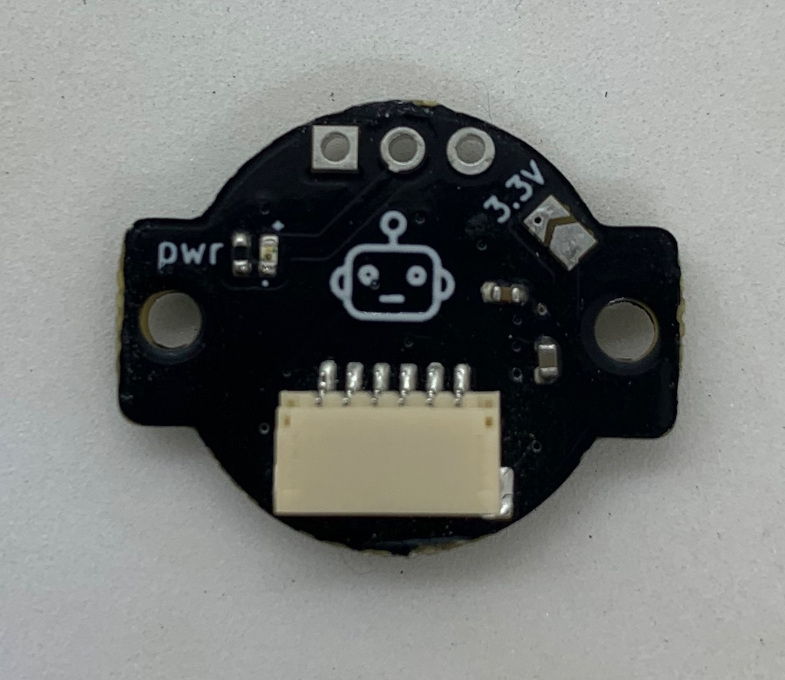
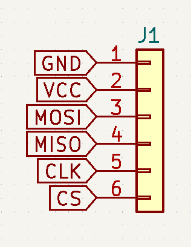
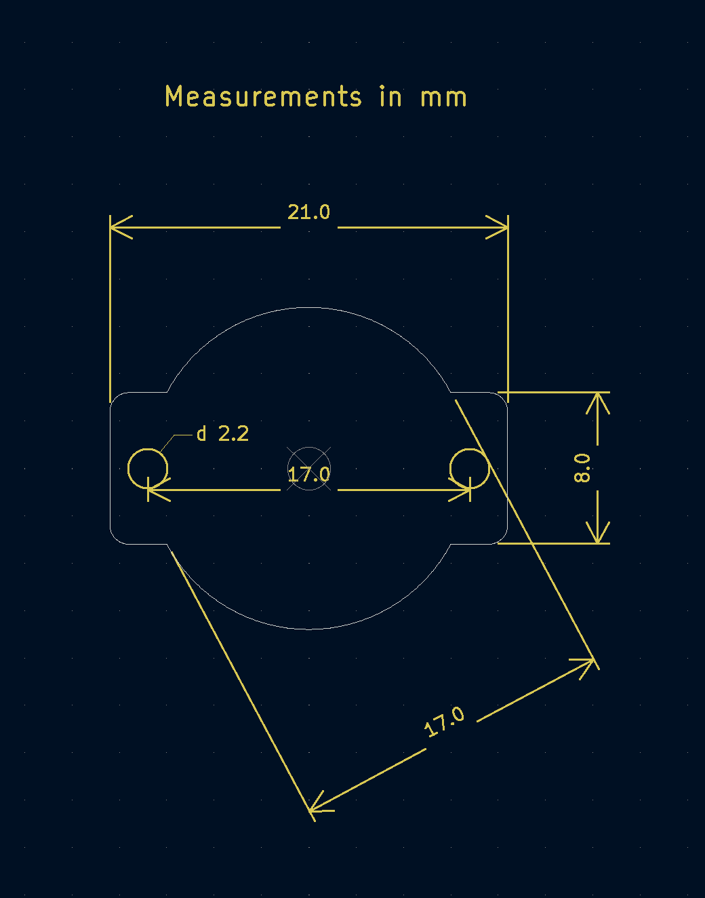

# AS5048A magnetic angle sensor

Small (21x17mm) board for the AS5048A magnetic absolute angle sensor.

For use in motor control or robotics applications, the sensor precisely measures the orientation (angle in the plane) of a nearby diametrically magnetized magnet.

That sounds more complicated than using it really is, so lets describe it another way:
- attach the magnet to the axis of something that rotates
- put the sensor near it
- read precise angles with your Arduino

Back of board with SH 1.0 connector

Front of board with sensor

## Features

- 3.3V (default) or 5V (break solder bridge for 5V)
- 14 bit accuracy, 16384 positions per revolution 
- SPI interface up to 10MHz
- PWM output pin with 1kHz PWM frequency and 12bit accuracy
- power indication LED (green, dim)

Datasheet of the sensor: https://ams.com/documents/20143/36005/AS5048_DS000298_4-00.pdf

## Usage

The sensor has to be precisely positioned near the magnet. The magnet should be precisely on-axis and in-plane (no wobble!). The sensor should be mounted with an air-gap of about 0.5mm to the magnet.

Taking the time to mount the magnet and sensor board carefully will improve the accuracy and smoothness of your readings.

The sensor has an SPI interface:

The SPI interface is available on a JST-SH 6-pin socket. Pre-made cables are available cheaply on AliExpress and other sources.

You may connect VCC to either 3.3V or 5V. 

- If using 5V, break the connection between teh solder bridge pads on the back (sensor) side of the board.
- If using 3.3V, do not break (or re-connect) the solder-bridge.

Connect the other lines (MOSI, MISO, CLK and CS) to the respective counterparts on your MCU board.

Note: The sensor board does not pull the CS line up.

## Communications

SPI interface:
- SPI Mode 1
- MSB first
- max 10MHz SPI clock

See datasheet for details, or use software driver.

:warning: Note: cable length, shielding (or lack thereof) and environmental noise may limit performance to significantly less than the 10MHz maximum.

## Software

The sensor can be used with any appropriate SPI driver.

The author uses it with Arduino-compatible MCU boards and the [SimpleFOC library](http://www.simplefoc.com).

A driver for the sensor for Arduino and SimpleFOC can be found here: [SimpleFOC drivers library](https://github.com/simplefoc/Arduino-FOC-drivers/tree/master/src/encoders/as5048a)

## Physical dimensions

21 x 17 x 4mm

