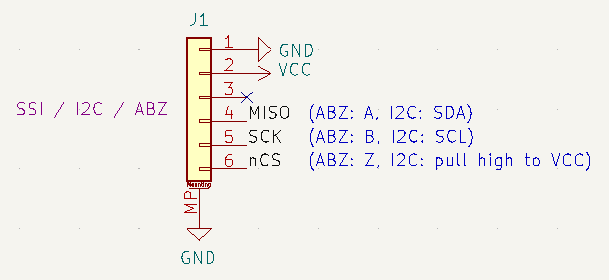

# MT6701 magnetic angle sensor

Small (21x17mm) board for the MT6701 magnetic absolute angle sensor.

For use in motor control or robotics applications, the sensor precisely measures the orientation (angle in the plane) of a nearby diametrically magnetized magnet.

That sounds more complicated than using it really is, so lets describe it another way:
- attach the magnet to the axis of something that rotates
- put the sensor near it
- read precise angles with your Arduino

| Back of board | Front of board |
| --- | --- |
| with SH 1.0 connector  | with sensor  |

## Features

- 3.3V or 5V power
- SSI, ABZ and I2C digital interfaces (SH 1.0 connector)
- Analog interface (solder pad)
- Push interface (solder pad)
- 14 bit accuracy, 16384 positions per revolution on SSI and I2C
- 12 bit accuracy, 4096 positions per revolution on ABZ and analog
- SSI interface up to 10MHz
- power indication LED (green, dim)
- seperate I2C programming board available, see [here]().

Datasheet of the sensor: 

## Getting one

You may be able to buy some here:

Or you could make one - it is open source, you will find gerber files and BOM in the repo, and design files for KiCad 6.

## Getting help

Please visit our discord: https://discord.gg/FwTymtVhMU

Or if you have found a problem, you can also open a bug-ticket here on GitHub.

## Usage

The sensor has to be precisely positioned near the magnet. The magnet should be precisely on-axis and in-plane (no wobble!). The sensor should be mounted with an air-gap of about 0.5mm to the magnet.

Taking the time to mount the magnet and sensor board carefully will improve the accuracy and smoothness of your readings.

The sensor's SSI / ABZ / I2C interface has the following pin-out:

The SSI / ABZ / I2C interface is available on the JST-SH 6-pin socket. Pre-made cables are available cheaply on AliExpress and other sources.

You can switch between ABZ mode and SSI / I2C mode using the small switch on the back of the sensor board. Don't change the mode while the sensor is powered. When in ABZ mode, the sensor will output encoder pulses (see pinout).
When in SSI / ABZ mode, connect the nCS 

You may connect VCC to either 3.3V or 5V. 

Connect the other lines to the respective counterparts on your MCU board according the pinout shown above.

Note: The sensor board does not pull the CS line up.

## Communications

SPI interface:
- SPI Mode 1
- MSB first
- max 10MHz SPI clock

See [datasheet]() for details, or use an existing software driver.

:warning: Note: cable length, shielding (or lack thereof) and environmental noise may limit performance to significantly less than the 10MHz maximum.

## Software

The sensor can be used with any appropriate SPI driver.

The author uses it with Arduino-compatible MCU boards and the [SimpleFOC library](http://www.simplefoc.com).

A driver for the sensor for Arduino and SimpleFOC can be found here: [SimpleFOC drivers library](https://github.com/simplefoc/Arduino-FOC-drivers/tree/master/src/encoders/mt6701)

## Physical dimensions

21 x 17 x 4mm (1.6mm PCB)

## Cables

Pre-made JST SH 1.0 cables are available. When buying cables with two plugs, choose the type that is called "reverse connection" - where the pins on both ends of the cable have the same order.

Some links to compatible cables / breakout boards:

 - https://www.tindie.com/products/26431/
 - https://www.aliexpress.com/item/4000421829259.html
 - https://www.aliexpress.com/item/4001235017139.html
 - https://www.pololu.com/product/4770
 - https://www.pololu.com/product/4772

